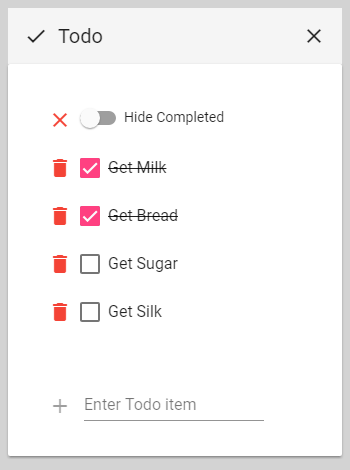

# MaterialTodo

This project was generated with [Angular CLI](https://github.com/angular/angular-cli) version 1.5.0.

This is implemented using

- Angular 5
- Angular Material

It can run in two modes:

## Web

```
> ng serve
```

Then open browser at http://localhost:4200


## Electron

```
> npm run electron
```


## Run in nginx docker container

### Build

```
> ng build
```

This produces output in dist folder.

### Dockerfile

```
FROM nginx:alpine
COPY dist /usr/share/nginx/html
```

### Build docker image from Docker file

```
> docker build -t materialtodo .
```

### Run docker container

```
> docker run -d -p 4200:80 --name MaterialTodo materialtodo                                                                                                  9934d5a9513ad4f39c46bf65031962a92d7659fb162bcf5357fbc8a41308bf65
```

### Access MaterialTodo running in container

```
Launch browser with URL: http://<docker-machine-ip>:4200
```


## Development server

Run `ng serve` for a dev server. Navigate to `http://localhost:4200/`. The app will automatically reload if you change any of the source files.

## Code scaffolding

Run `ng generate component component-name` to generate a new component. You can also use `ng generate directive|pipe|service|class|guard|interface|enum|module`.

## Build

Run `ng build` to build the project. The build artifacts will be stored in the `dist/` directory. Use the `-prod` flag for a production build.

## Running unit tests

Run `ng test` to execute the unit tests via [Karma](https://karma-runner.github.io).

## Running end-to-end tests

Run `ng e2e` to execute the end-to-end tests via [Protractor](http://www.protractortest.org/).

## Further help

To get more help on the Angular CLI use `ng help` or go check out the [Angular CLI README](https://github.com/angular/angular-cli/blob/master/README.md).
